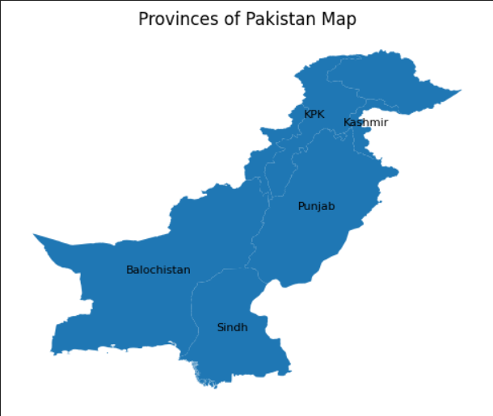
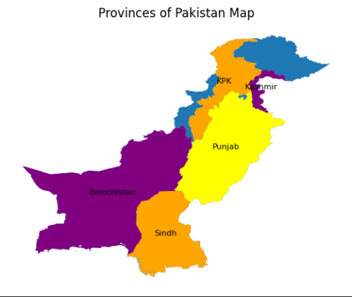
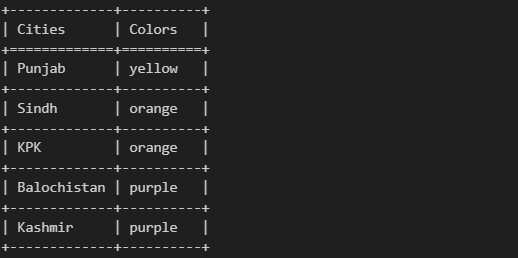

<div align='center'>

<h1>Constraint-Satisfaction-Problem for Graph Colouring</h1>
<p>Graph Colouring For Pakistan Map using Constraint Satisfaction Problem Algorithm including Naïve search, Backtracking Search, Backtracking Search with Heuristics (Minimum Remaining Values (MRV) & Least Constraining Value (LCV)), Arc Consistency and Forward Checking.</p>

</div>

## :star2: Dependencies
<div align='center'>
<p>Make sure you have the following dependencies installed:</p>

```bash
pip install geopandas  
pip install pandas  
pip install matplotlib
pip install tabulate  
```
</div>


## :star2: About the Project

### :camera: Screenshots
<div align='center'>
<h4>Pakistan Provinces Map</h4>
</div>
<div align="center"> <a href=""></a> </div>
<div align='center'>
<h4>Pakistan Provinces Map - Graph Coloring</h4>
</div>
<div align="center"> <a href=""></a> </div>
<div align="center"> <a href=""></a> </div>

